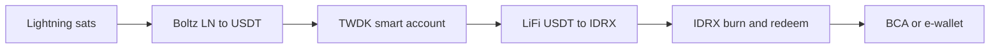
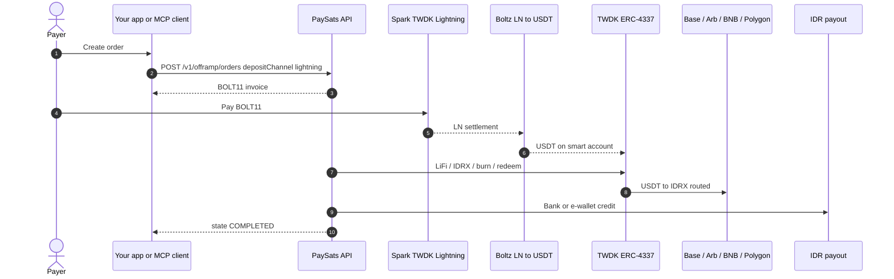

# Tether Lightning rails


This page is the **PaySats-side reference** for **Lightning ↔ USDT** settlement via **Tether WDK**. It is intentionally separate from the core [product primitives](../introduction/primitives.md) story (BNB Chain DCA, borrowing, and bank settlement).

A dedicated Tether product GitBook may ship later; this stub holds the integration detail integrators need today.


## What this covers

When you choose `depositChannel: "lightning"` on a settlement order, PaySats uses:

* **Tether WDK Spark:** Lightning invoice creation and settlement.
* **Boltz:** LN → **USDT** swap onto an operator smart account.
* **TWDK ERC-4337 safes:** USDT routing across EVM chains (Base, Arbitrum, BNB Chain, Polygon) before the IDRX / fiat leg.

Wrapped BTC paths (`cbbtc`, `btcb`) skip Boltz and route via **LiFi** instead. See [Deposit rails](../developers/deposit-rails.md).

## Lightning in → USDT → IDR out

Sequence view (settlement orders with `depositChannel: "lightning"`):

## Stack components

| Component | Role |
|-----------|------|
| **Tether WDK Spark** | Lightning wallet / invoice layer for the operator |
| **Boltz** | Atomic LN → USDT swap; preimage-verifiable Lightning payment |
| **TWDK ERC-4337 safes** | Per-tenant smart accounts holding USDT and executing LiFi / redeem steps |
| **LiFi** | USDT → IDRX (and cross-chain routing where needed) |
| **IDRX** | IDR-pegged stablecoin; burn / redeem onto Indonesian bank and e-wallet rails |


**USDT** is the Tether stablecoin leg in the Lightning path. **USDC** appears in quotes and some swap routes but Lightning settlement today flows through **USDT via Boltz**, not a direct "pay with USDC on Lightning" product.


## Developer touchpoints

Everything still goes through the same settlement API:

| Step | Call |
|------|------|
| Quote | `getBtcIdrQuote()` |
| Payout list | `listPayoutMethods()` |
| Create order | `createOfframpOrder({ depositChannel: "lightning", ... })` |
| Pay | Payer settles returned **BOLT11** |
| Status | `getOfframpOrder()` / `waitForOfframpOrder()` |

See [HTTP API](../developers/http-api.md), [SDK](../developers/sdk.md), and [Order lifecycle](../developers/order-lifecycle.md).

## Lightning payment proof

After a Lightning payment, the payer can verify settlement using the invoice and preimage at [validate-payment.com](https://validate-payment.com/). The order route exposes explorer and proof links when available.

## Related

* [How it works: settlement primitive](../introduction/how-it-works.md)
* [Deposit rails](../developers/deposit-rails.md): all `depositChannel` values
* [Example end-to-end flow](../reference/example-flow.md): worked Lightning → BCA example
