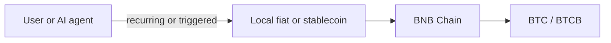
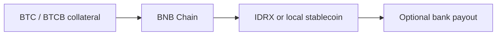
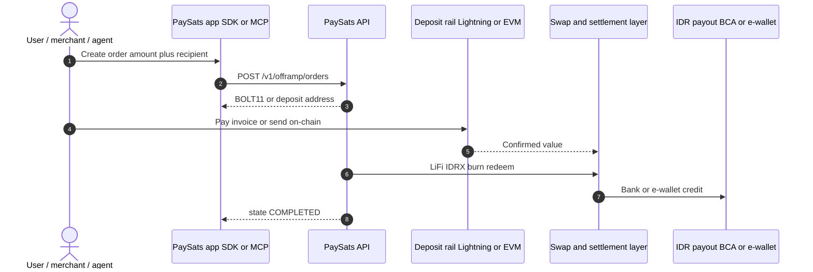
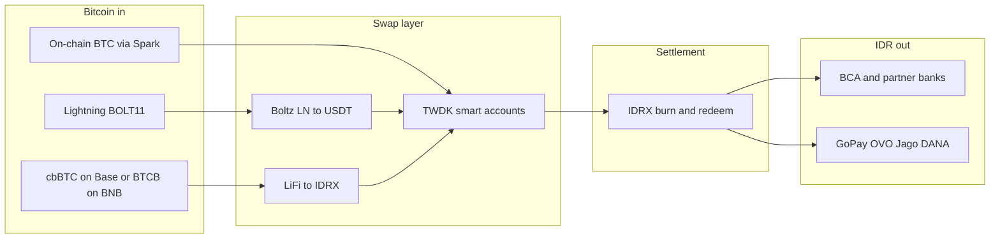

# How it works


This page is a **high-level overview** of all three [product primitives](primitives.md). Routing detail, fee policy, and provider-level internals are intentionally locked at this stage.


## Three primitives overview

| Primitive | One-line | Status |
|-----------|----------|--------|
| **Agentic DCA into BTC** | Scheduled or agent-triggered conversion from local fiat into BTC on BNB Chain | **Live** |
| **BTC-backed borrowing** | Lock BTC collateral; borrow local stablecoins (e.g. IDRX) | **Live** |
| **Bank settlement** | On-chain value → named bank / e-wallet via licensed redeem partners | **Live (IDR)** |

The sections below describe each primitive. Settlement has the fullest developer surface today.

## DCA primitive

* Agent or user sets amount and cadence in local currency.
* PaySats executes swaps on **BNB Chain** into **BTC** or **BTCB**.
* Agents invoke DCA via **MCP** / **x402** without manual babysitting.

**BTCB** deposit rails on BNB support DCA and settlement; see [Supported rails](supported-rails.md).

## Borrowing primitive

* User locks **BTC** (or **BTCB**) as collateral.
* PaySats routes a borrow leg into **IDRX** or market-specific stablecoins.
* Borrowed stablecoins stay on-chain or flow into the **settlement** primitive for bank payout.

## Settlement primitive

This is what the **SDK**, **HTTP API**, and **MCP server** implement today.

### End-to-end sequence

Lightning and **USDT** legs (Boltz, Tether WDK Spark) are documented under [Tether Lightning rails](../integrations/tether-lightning.md), not repeated here.

### Settlement flow diagram

### What you touch as a developer


You interact with **one API** and **one SDK call**. Swap and settlement orchestration is server-side.


| Layer | What you do | What PaySats does |
|-------|-------------|-------------------|
| **Quote** | `getBtcIdrQuote()` | Cached BTC/IDR + USDC/IDR rate |
| **Payout discovery** | `listPayoutMethods()` | Live list of banks + e-wallets with `bankCode` / `bankName` |
| **Order creation** | `createOfframpOrder({ idrAmount, depositChannel, ... })` | Lock quote, derive deposit target, return BOLT11 or deposit instructions |
| **Payment** | Payer pays BOLT11 or sends cbBTC / BTCB | Server watches deposit, starts swap pipeline |
| **Swap** | (server-side) | LN → USDT via Boltz, or wrapped BTC → IDRX via LiFi |
| **Settle** | (server-side) | USDT → IDRX, then IDRX burn + redeem |
| **Payout** | (server-side) | Partner credits BCA bank or e-wallet |
| **Status** | `getOrder()` or `waitForOrder()` | State transitions to `COMPLETED` / `FAILED` |

See [Order lifecycle](../developers/order-lifecycle.md) for the full state machine.

## What's live vs what's coming

| Area | Status |
|------|--------|
| **Bank settlement:** Lightning in → BCA bank out | **Live** |
| **Bank settlement:** Lightning in → e-wallet out | **Live** |
| **Bank settlement:** cbBTC (Base) in → IDR out | **Live (operator-triggered swap)** |
| **Bank settlement:** BTCB (BNB Chain) in → IDR out | **Live (operator-triggered swap)** |
| **Agentic DCA into BTC** | **Live** |
| **BTC-backed borrowing (IDRX)** | **Live** |
| **PHP / VND / THB bank settlement** | **Planned** |
| **INR bank settlement** | **Planned** |
| Native on-chain BTC via Spark deposit addresses | **Wired; integrating in SDK surface** |
| QRIS ⇄ IDRX full round-trip | **In progress** |
| Gift cards and e-vouchers | **In progress** |
| x402-compatible agent payment rails | **Planned** |
| Webhooks (push notifications for order state) | **Planned** |

Next: [Supported rails](supported-rails.md) · [Product primitives](primitives.md) · [Settlement quickstart](../getting-started/quickstart.md)
