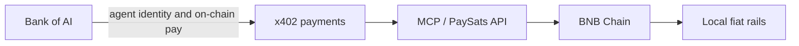

# Product primitives

PaySats exposes **three primitives on BNB Chain** for users and AI agents operating across Southeast Asia:

1. **Agentic DCA into BTC:** programmatic, recurring conversion out of weakening local currency into Bitcoin.
2. **BTC-backed borrowing:** collateralize BTC to borrow local-currency stablecoins (e.g. IDRX).
3. **Bank settlement:** move value between on-chain wallets and named bank or e-wallet accounts through licensed redeem partners.

## Why these primitives matter

Southeast Asian currencies (**IDR**, **PHP**, **VND**, and **THB**) are structurally fragile versus the dollar. Over time, holding only local fiat erodes purchasing power. **BTC** and regulated dollar stablecoins like **USDC** tend to preserve it.

PaySats is an **agentic Bitcoin and stablecoin settlement app for Southeast Asia**, built on **BNB Chain**. Users and AI agents can:

* **DCA** out of local currency into BTC on a schedule or on agent trigger.
* **Collateralize** that BTC to borrow IDR-denominated stablecoins such as **IDRX**.
* **Settle** directly into Indonesian bank accounts and e-wallets, with **PHP**, **VND**, **THB**, and **INR** rails on the roadmap.

By porting Privy / **x402** agent payment patterns from Base onto BNB, PaySats lets AI agents autonomously move value from BTC or USDT into local currency without manual exchange babysitting.

## Status today

| Primitive | What it does | Status |
|-----------|--------------|--------|
| **Agentic DCA into BTC** | Recurring or agent-driven conversion from local fiat into BTC on BNB Chain | **Roadmap** |
| **BTC-backed borrowing** | Lock BTC collateral; borrow local stablecoins (e.g. IDRX) | **Roadmap** |
| **Bank settlement** | Wallet ↔ named bank / e-wallet via licensed redeem partners | **Live (IDR)**; PHP / VND / THB / INR expanding |


**Live today:** the **bank settlement** primitive. Create an off-ramp order via the [SDK](../developers/sdk.md), [HTTP API](../developers/http-api.md), or [MCP server](../developers/mcp-server.md) and settle IDR to BCA, GoPay, OVO, and other Indonesian rails. See [Settlement quickstart](../getting-started/quickstart.md).


## The agent stack

* **Bank of AI:** agent identity and on-chain payment infrastructure.
* **PaySats:** the **last-mile settlement layer** that gets agent and user flows into **IDR today**, and into **PHP**, **VND**, **THB**, and **INR** next.
* **MCP:** live today for quotes, payout discovery, and order creation. **x402-compatible** agent rails are on the roadmap as we port agent work from Base to BNB.

Lightning and USDT settlement legs (Boltz, Tether WDK) are documented separately under [Tether Lightning rails](../integrations/tether-lightning.md), not the core BNB Chain product identity.

## Primitive detail

### 1. Agentic DCA into BTC (roadmap)

Intended flow:

* User or agent sets a recurring amount in local currency (or stablecoin).
* PaySats schedules swaps on BNB Chain into **BTC** or wrapped BTC (**BTCB**).
* Agents trigger DCA via MCP / x402 without a human sitting on each trade.

No public DCA API is shipped yet. Deposit rails for wrapped BTC on BNB are already live; see [Supported rails](supported-rails.md).

### 2. BTC-backed borrowing (roadmap)

Intended flow:

* User locks **BTC** (or BTCB) as collateral on BNB Chain.
* PaySats routes a borrow leg into **IDRX** or other local stablecoins.
* Borrowed stablecoins can be held on-chain or routed into the **settlement** primitive for bank payout.

No public borrow API is shipped yet. IDRX is the live settlement stablecoin in Indonesia today.

### 3. Bank settlement (live)

The production primitive today:

* **In:** Lightning (BOLT11), **cbBTC** on Base, or **BTCB** on BNB Chain.
* **Middle:** stablecoin routing and **IDRX** burn / redeem.
* **Out:** named Indonesian bank account or e-wallet.

End-to-end architecture: [How it works](how-it-works.md) · Worked example: [Example flow](../reference/example-flow.md).

## Markets

| Market | Currency | Settlement status |
|--------|----------|-------------------|
| Indonesia | IDR | **Live** |
| Philippines | PHP | Planned |
| Vietnam | VND | Planned |
| Thailand | THB | Planned |
| India | INR | Planned |

Payout methods are always served live from `GET /v1/payout/methods`. Never hard-code bank codes. See [Supported rails](supported-rails.md).

Next: [How it works](how-it-works.md) · [Why PaySats](why-paysats.md) · [Settlement quickstart](../getting-started/quickstart.md)
