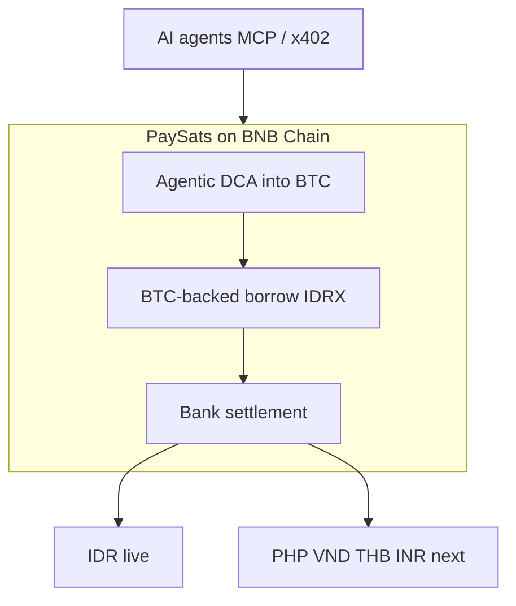

# Welcome to PaySats

PaySats is an **agentic Bitcoin and stablecoin settlement app for Southeast Asia**, built on **BNB Chain**. Users and AI agents **DCA into BTC**, **collateralize BTC to borrow local stablecoins** (e.g. IDRX), and **settle directly into bank accounts**, starting with **IDR** in Indonesia, expanding to **PHP**, **VND**, **THB**, and **INR**.

Southeast Asian fiat bleeds slowly against the dollar. BTC and dollar stablecoins like USDC preserve purchasing power. PaySats is the **last-mile settlement layer** that connects on-chain value to named local accounts via **MCP** today and **x402-compatible** agent rails next.

## Three primitives

| Primitive | Summary | Status |
|-----------|---------|--------|
| **Agentic DCA into BTC** | Recurring / agent-driven exit from local currency into BTC on BNB | **Live** |
| **BTC-backed borrowing** | Collateralize BTC; borrow IDR stablecoins (IDRX) | **Live** |
| **Bank settlement** | Wallet ↔ bank / e-wallet through licensed redeem partners | **Live (IDR)** |

Full detail: [Product primitives](introduction/primitives.md).

## Where to next

<table data-view="cards"><thead><tr><th></th><th></th><th data-hidden data-card-target data-type="content-ref"></th></tr></thead><tbody><tr><td><strong>Why PaySats</strong></td><td>SEA currency bleed, P2P risk, and the case for trusted programmatic settlement.</td><td><a href="introduction/why-paysats.md">why-paysats.md</a></td></tr><tr><td><strong>Product primitives</strong></td><td>DCA, borrowing, and bank settlement on BNB Chain.</td><td><a href="introduction/primitives.md">primitives.md</a></td></tr><tr><td><strong>Settlement quickstart</strong></td><td>Your first IDR bank settlement in five steps using the SDK.</td><td><a href="getting-started/quickstart.md">quickstart.md</a></td></tr><tr><td><strong>MCP server</strong></td><td>Agent last-mile settlement: quote, list rails, create orders.</td><td><a href="developers/mcp-server.md">mcp-server.md</a></td></tr></tbody></table>

## What PaySats does, in one picture

**Live settlement path (today):**

* **Bitcoin in:** Lightning (see [Tether Lightning rails](integrations/tether-lightning.md)), **cbBTC** on Base, or **BTCB** on BNB Chain.
* **Stablecoin middle:** IDRX burn / redeem via licensed partners.
* **IDR out:** BCA and partner banks, or e-wallets (GoPay, OVO, Jago, …).

## Developer hub


PaySats exposes **three integration surfaces** for the **settlement primitive**: HTTP `/v1`, `@paysats/sdk`, and `@paysats/mcp`. All three use the same tenant API key.


<table data-view="cards"><thead><tr><th></th><th></th><th data-hidden data-card-target data-type="content-ref"></th></tr></thead><tbody><tr><td><strong>HTTP API /v1</strong></td><td>curl, TypeScript, and SDK examples for every endpoint.</td><td><a href="developers/http-api.md">http-api.md</a></td></tr><tr><td><strong>Order lifecycle</strong></td><td>All order states from <code>IDLE</code> to <code>COMPLETED</code>, with terminal-state rules.</td><td><a href="developers/order-lifecycle.md">order-lifecycle.md</a></td></tr><tr><td><strong>Deposit rails</strong></td><td>Lightning, cbBTC on Base, and BTCB on BNB Chain. What each rail returns.</td><td><a href="developers/deposit-rails.md">deposit-rails.md</a></td></tr><tr><td><strong>Payout methods</strong></td><td>Banks vs e-wallets, <code>bankCode</code>/<code>bankName</code>, and recipient format rules.</td><td><a href="developers/payout-methods.md">payout-methods.md</a></td></tr></tbody></table>

## Current status


**Beta.** **Agentic DCA**, **BTC-backed borrowing**, and **bank settlement (IDR)** are production-ready. **QRIS ↔ IDRX** and **gift-card** flows are actively being wired. See [Supported rails](introduction/supported-rails.md) and [Product primitives](introduction/primitives.md).


Need access? Ping us on Telegram at [@vibcrypto](https://t.me/vibcrypto) to request a tenant API key, or email <code class="expression">space.vars.support_email</code>.
